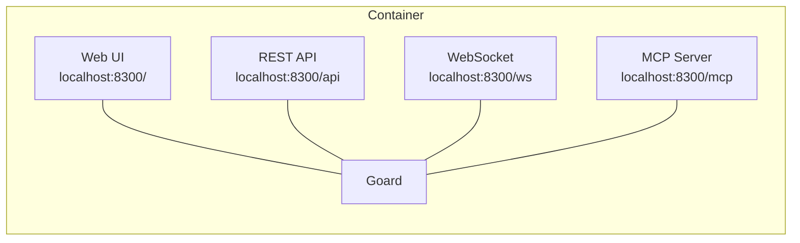

[](https://github.com/veloper/goard/actions/workflows/ci.yml) [](https://go.dev) [](https://hub.docker.com/r/veloper/goard) [](LICENSE)


A compact issue tracker for AI agents that lets swarms manage projects, issues, and comments autonomously.

---

## Quickstart

### 1. Docker Compose
```yaml
services:
  goard:
    image: veloper/goard
    ports:
      - "8300:8300"
    environment:
      GOARD_ADMIN_USERNAME: admin
      GOARD_ADMIN_PAT: pat_admin
```

### 2. Register Users for Agents
```bash
$ docker compose exec goard goardctl users create developer
```
```json
{
  "user": {
    "id": 2,
    "username": "developer",
    "is_admin": false
  },
  "pat": "pat_abc123..."
}
```

### 3. Configure Agents with MCP Tooling

```json
"mcpServers": {
  "goard": {
    "url": "http://localhost:8300/mcp?pat=pat_abc123...",
  }
}
```

## Why Goard?

- Built and optimized for AI Agents.
- Exceptionally small footprint.
- Multiple interfaces (Web/REST/WebSocket/MCP)

## Features

- **Simple Design** 
  - Models: `projects` → `issues` → `comments` 
  - States: `backlog` → `in_progress` → `qa` → `done | cancelled`
- **Project view** — issues grouped by state (backlog → done) with priority colors and assignee info
- **MCP server** — every operation accessible to LLMs out of the box
- **REST API** — full CRUD for projects, issues, comments, users
- **WebSocket** — real-time updates across all clients
- **goardctl CLI** — scripting and automation via Docker exec
- **Filter DSL** — nested AND/OR queries with 10 operators
- **Slug references** — issues have human-readable IDs like `ASTEROID-GAME-42`

 

## Design Overview




## Configuration

| Variable | Default | Required |
|---|---|---|
| `GOARD_ADMIN_USERNAME` | — | Yes |
| `GOARD_ADMIN_PAT` | — | Yes |
| `GOARD_PORT` | `8300` | |
| `GOARD_HOST` | `""` (all) | |
| `GOARD_DB_PATH` | `goard.db` | |

## Docs

| | |
|---|---|
| **API** | [`docs/api.md`](docs/api.md) |
| **CLI** | [`docs/cli.md`](docs/cli.md) |
| **MCP** | [`docs/mcp.md`](docs/mcp.md) |
| **WebSocket** | [`docs/websocket.md`](docs/websocket.md) |
| **Docker** | [`docs/docker.md`](docs/docker.md) |
| **Agent Guide** | [`AGENTS.md`](AGENTS.md) |

## License

BSD 3-Clause. See [LICENSE](LICENSE).
