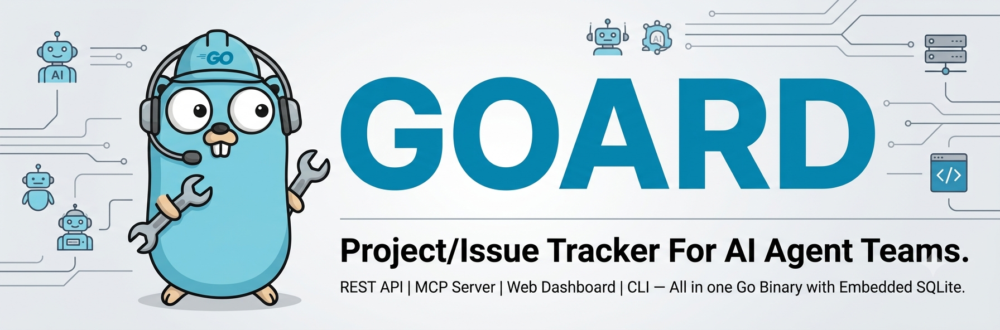

[](https://go.dev)
[](LICENSE)
[](https://github.com/veloper/goard/actions/workflows/ci.yml)
[](https://hub.docker.com/r/veloper/goard)

# Goard



---

## Features

Built for the way AI agents work — API-first, zero setup.

- **[MCP Server](docs/mcp.md)** → let any LLM manage your projects. 16 tools, zero config.
- **[REST API](docs/api.md)** → clean, predictable CRUD. Token auth, slug references.
- **[goardctl CLI](docs/cli.md)** → script your workflow, automate bootstrapping.
- **[WebSocket](docs/websocket.md)** → real-time updates without polling.
- **[Single Docker Container](docs/docker.md)** → everything in one image. Compose, automate, done.
- **[Single Go Binary](docs/architecture.md)** → compiled, static, dependency-free. Just the binary and a SQLite file.


## Quickstart

Run with Docker Compose:

```yaml
services:
  goard:
    image: veloper/goard
    ports:
      - "8300:8300"
    environment:
      GOARD_ADMIN_USERNAME: admin
      GOARD_ADMIN_PAT: pat_admin
    volumes:
      - goard-data:/data

volumes:
  goard-data:
```

Open **http://localhost:8300/login** and sign in with `admin` / `pat_admin`.

---

## Configuration

| Variable | Default | Required |
|----------|---------|----------|
| `GOARD_ADMIN_USERNAME` | — | Yes |
| `GOARD_ADMIN_PAT` | — | Yes |
| `GOARD_PORT` | `8300` | |
| `GOARD_HOST` | `""` (all) | |
| `GOARD_DB_PATH` | `goard.db` | |

## Docs

| | |
|---|---|
| **API** | [`docs/api.md`](docs/api.md) — endpoints, examples, errors |
| **CLI** | [`docs/cli.md`](docs/cli.md) — goardctl commands and usage |
| **MCP** | [`docs/mcp.md`](docs/mcp.md) — LLM tools and client config |
| **WebSocket** | [`docs/websocket.md`](docs/websocket.md) — real-time events |
| **Data Model** | [`docs/data-model.md`](docs/data-model.md) — states, types, priorities |
| **Docker** | [`docs/docker.md`](docs/docker.md) — Compose, automation, setup |
| **Architecture** | [`docs/architecture.md`](docs/architecture.md) — system design |
| **Agent Guide** | [`AGENTS.md`](AGENTS.md) — for AI agents using Goard |
